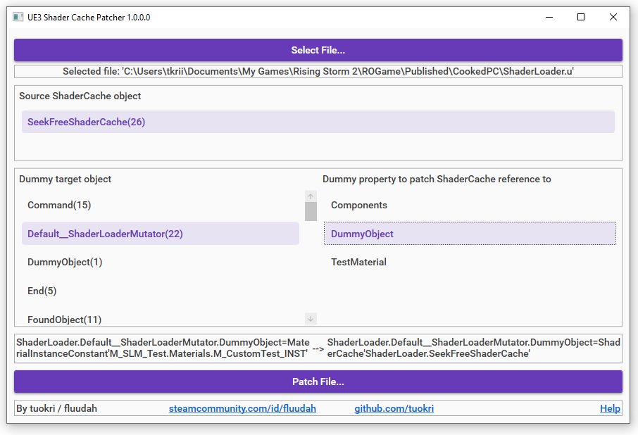

RS2 demo mutator for https://github.com/tuokri/UE3ShaderCachePatcher

How it works:

UE3 Shader Cache Patcher is used to set the object reference of `ShaderLoaderMutator.DummyObject`
to `ShaderLoader.SeekFreeShaderCache`, forcing the game into loading the shader
cache when the mutator script package is loaded.

